# Java単元課題6

---

[リポジトリ](https://github.com/tc-kishimoto/Java-RPN)

## 基本課題

### 概要

課題は、数式をパースして逆ポーランド記法に変換し、計算を行うプログラムの実装です。
「1 + 2」など普段の生活で使用している数式は中置記法と呼ばれるもので、演算子がオペランドの真ん中にきます。
逆ポーランド記法は「1 2 +」のように演算子がオペランドの後にきます。
逆ポーランド記法は計算の優先順位を上げる「()」が不要などの利点があります。
今回は数式を、数値や演算子をノードの値としてもった二分木に展開することで、逆ポーランド記法への変換を行います。
そして展開した二分木を利用して、実際に計算結果まで求めます。
数式 → 二分木 → 逆ポーランド記法の流れのサンプルとして、ExprTreeSampleが含まれているので参考にしてください。

### 実装内容

実装内容として、以下の要件を満たしてください。

* 四則演算（+ - * /）の計算ができること
* 入力値として1桁の整数の計算ができること
* 計算時のオーバーフローは考慮しなくてよい
* 数式内のスペースは考慮しなくてよい

ユニットテスト

JUnitのテストケースがプロジェクトに含まれています。
全てのテストケースをパスしてください。

### 実装対象と実装方針

実装の対象は以下の2つとなります。

* jp.co.example.parser.MathExpParser
  * parseメソッド
* jp.co.example.struct.traverse.CalcStrategy
  * executeメソッド
  * getResultメソッド

※ まずは修正対象のクラスだけでなく全体のプログラムを把握しましょう。

数式を二分木の形にパースします。
以下のようなイメージになるようpaseメソッドを実装してください。

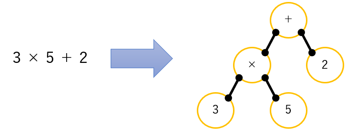  

記号（＋、－、×、÷）にはOpNodeクラスを使用します。

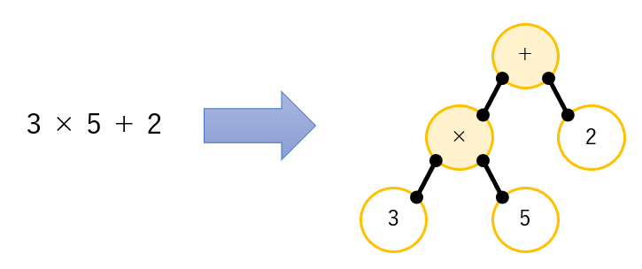  

数値にはIntegerNodeクラスを使います。

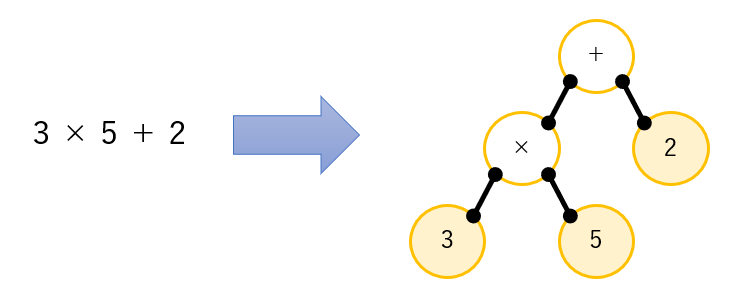  

各Nodeのフィールド（leftおよびright)に子Nodeへの参照を設定することで各ノードを繋ぎます。

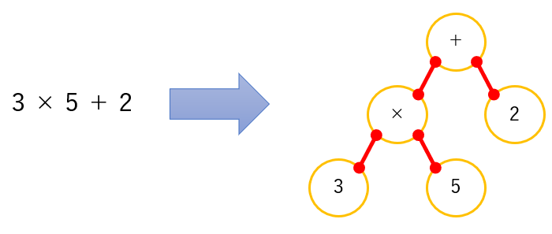  

パースの手順は何通りもありますが、一番優先順位の低い演算子を基準にパースする方法が考え方としては簡単です。

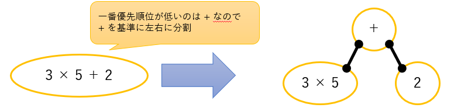  

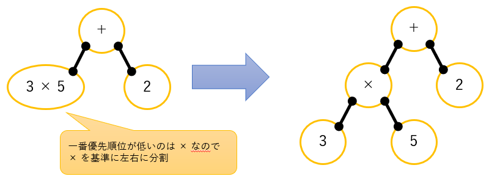  

CalcStrategyクラスはTreeTraverseクラスと合わせて、二分木のパースされた情報を基に計算を行っています。

TreeTraverseクラスのpostOrderメソッドでは以下の処理を行っています。

* 左下にNodeがあるか確認
  * →左下にNodeがあればそのNodeに対して1～3を実施
* 右下にNodeがあるか確認
  * →右下にNodeがあればそのNodeに対して1～3を実施
* 今のNodeに引数で渡されたNodeStrategy（今回はCalcStrategy）のexecuteを実行

以降の処理になるようexecuteメソッド、getResultメソッドを実装してください。

イメージは以下になります。
一番上のNodeを検査対象のNodeとして処理を開始。
左下にNodeがあれば左下のNodeを検査対象として再度自身（postOrder）を呼び出します。

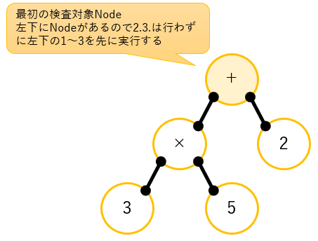  

次の検査対象は『×』のNode
左下にNodeがあれば左下のNodeを検査対象として再度自身（postOrder）を呼び出します。

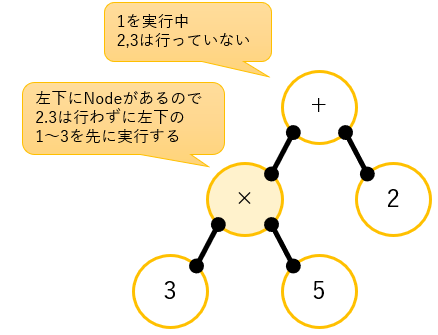  

次の検査対象は『3』のNode
左下、右下、ともにNodeがないのでexecute（実装対象）を実行します。
このとき、『3』をstackに積んでください。

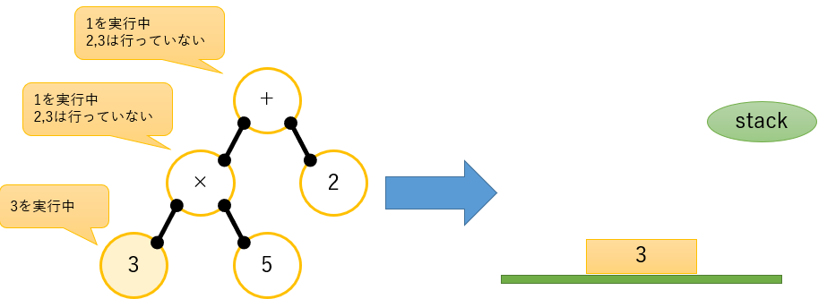  

次の検査対象は戻って『×』のNode
右下にNodeがあれば右下のNodeを検査対象として再度自身（postOrder）を呼び出します。

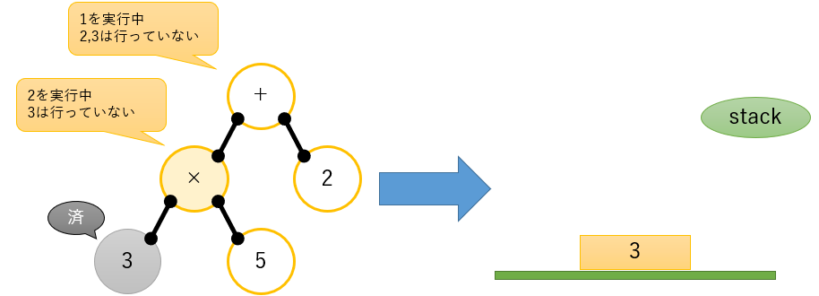  

次の検査対象は『5』のNode
左下、右下、ともにNodeがないのでexecute（実装対象）を実行します。
このとき、『5』をstackに積んでください。

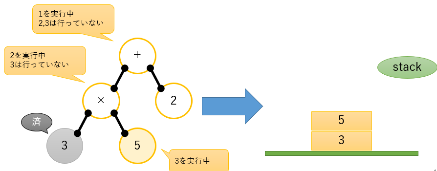  

次の検査対象は戻って『×』のNode
1、2が終わっているのでexecute（実装対象）を実行します。
このとき、stackから上の二つの情報を取り出し、掛け算をして積みなおします。

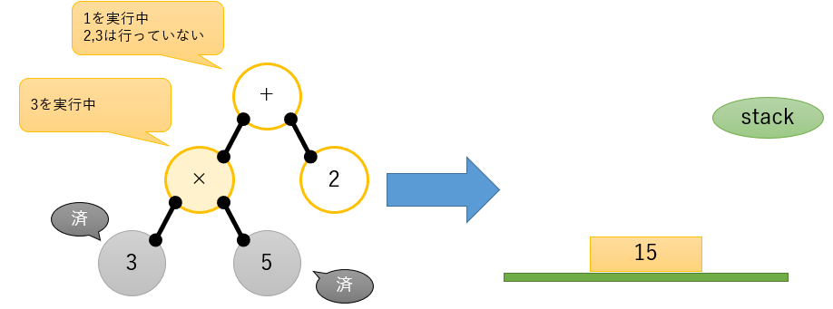  

次の検査対象は戻って『＋』のNode
右下にNodeがあれば右下のNodeを検査対象として再度自身（postOrder）を呼び出します。

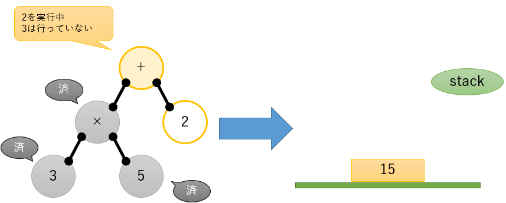  

次の検査対象は『2』のNode
左下、右下、ともにNodeがないのでexecute（実装対象）を実行します。
このとき、『2』をstackに積んでください。

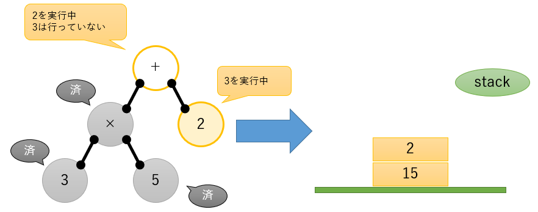  

次の検査対象は戻って『＋』のNode
1、2が終わっているのでexecute（実装対象）を実行します。
このとき、stackから上の二つの情報を取り出し、足し算をして積みなおします。

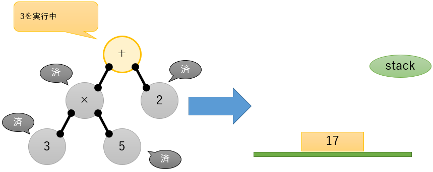  

全てのNodeの処理を終えました。
最後にgetResult（実装対象）が呼び出されますので、stackに残っている値を返却します。

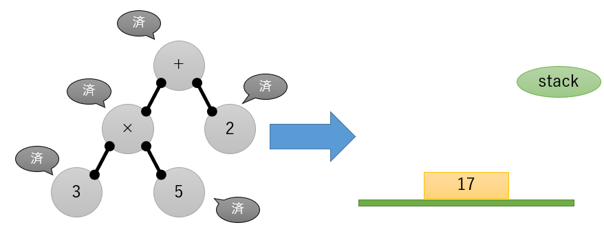  

### 実装上の注意点

課題を進める上でインターネットによる検索は問題ありません。
逆ポーランド記法や、実際にそこから計算する方法など調べる必要があると思います。

またプログラムの中には以下を記述してください。

* 参考にしたサイトのURL
* 実装内容に対するコメント

コメントを書く上では、How（どのような処理）ではなく、What（何をしている処理）またはWhy（なぜそういう実装なのか）を書くように心がけてください。

実行イメージ

以下は課題に期待される正しい挙動です。

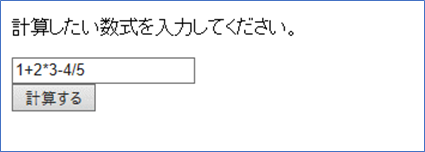  

↓

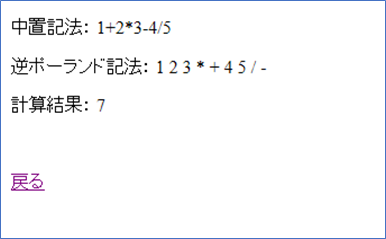  

---

## 発展課題

### 概要

基本課題で作成したアプリケーションの機能を拡張します。

以下の追加要件を実装してください

* 剰余算（%）に対応
* () の含まれる数式に対応
* 2桁以上の数値に対応
* ユニットテスト
  * JUnitのテストケースがプロジェクトに含まれています
  * コメントアウトされているテストケースのコメントを外したうえで、全てのテストケースをパスしてください

以下は課題に期待される正しい挙動です。

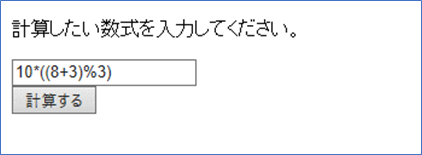  

↓

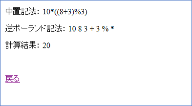  
