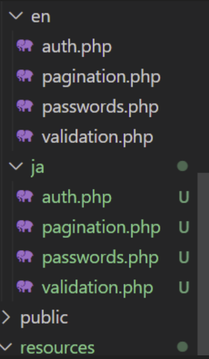

# バリデーション

Webアプリケーションではユーザーから不正なデータを⼊⼒されないように、⼊⼒チェックを⾏う必要があります。  
多くのフレームワークでは、バリデーションという機能によって⼊⼒チェックを⾏うことが可能です。  
Laravelでもバリデーションの機能があります。  

---

登録処理の際に、不正な値がセットされないようにバリデーションを使ったチェック処理を追加します。   
＜StudentController.php＞
```php
public function regist(Request $request, Student $student)
{
    $request->validate([
        'name' => 'required',
        'score' => 'required|integer|between:0,100'
    ]);
    $student->name = $request->name;
    $student->score = $request->score;
    $student->save();
    return redirect('/list');
}
```

---

ここではnameとscoreを必須⼊⼒とし、さらにscoreは0から100の間の数値しか⼊⼒できないように設定します。  
＜StudentController.php＞
```php
$request->validate([
    'name' => 'required',
    'score' => 'required|integer|between:0,100'
]);
```

---

### エラーの出力
view側ではエラーの場合はメッセージが出力されるようにします。  
＜list.blade.php＞
```php
<form action="regist" method="post">
    @csrf
    名前：<input type="text" name="name">
    @error('name')
    <span class="error">{{ $message }}</span>
    @enderror
    <br>
    スコア：<input type="number" name="score">
    @error('score')
    <span class="error">{{ $message }}</span>
    @enderror
    <br>
    <button>登録</button>
</form>
```

---

エラーに関する情報は$errors変数に格納されます。  
$errors変数に特定の属性のエラーメッセージがあるかどうかを、@errorディレクティブを使用して判断することができます。  
@errorディレクティブ内で$message変数を使用することでエラーメッセージの表示ができます。  
＜list.blade.php＞
```html
@error('name')
<span class="error">{{ $message }}</span>
@enderror
<br>
スコア：<input type="number" name="score">
@error('score')
<span class="error">{{ $message }}</span>
@enderror
```

---

### 結果の確認
⼊⼒しなかった場合や範囲外の値を⼊⼒した場合にエラーメッセージが表⽰されることを確認してください。  
必要に応じてCSSでスタイルを変更します。  
  
  

バリデーションによるチェックの種類やメッセージの操作方法などに関しては公式サイトを参照してください。  
[Laravel validation](https://readouble.com/laravel/8.x/ja/validation.html)

---

## エラーメッセージの日本語表記
上記のままだと、エラーメッセージが英語で表記されてしまい、エラー内容が分かりづらいです。  
エラーメッセージを日本語表記に変更してみましょう。  

Laravelのメッセージファイルは初期ではlang/enに設置されています。  
そのフォルダを丸ごとコピーしてjaフォルダを作成しましょう。  
  

---

validetionファイルのメッセージ内容を書き替えます。  
lang/ja/validation.phpのrequired項目を書き換えてみましょう。  
  

:attributeというのは入力する画面の項目名が入ります。  
validation.phpファイルの一番下にattributeを定義する箇所があります。  
項目名も日本語で表示されるように修正しましょう。  
左に項目名、右に日本語名を定義します。  
  

再度バリデーションメッセージを表示させてみましょう。  
日本語に変わっているはずです。  
  
