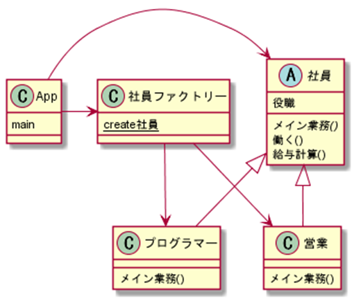

# デザインパターン2

---

ここではJavaを用いて、デザインパターンについての解説をします。  
Javaの基礎と、オブジェクト指向の基本を理解していることを前提とします。  

## デザインパターンとは

そもそもデザインパターンとは何でしょうか。  
デザインパターンは、オブジェクト指向言語の中でよく使用されるクラス設計をカタログ化したものです。  
様々なパターンがあるのですが、有名なのはGoFの23個のデザインパターンです。  
ここではその中から一部のデザインパターンを紹介します。  

## 進め方

ここでは、いくつかのデザインパターンを学習していきますが、学習の進め方としては、まずデザインパターンが何も使用されていないシンプルなプログラムを要します。  
このプログラムにいくつかのデザインパターンを順番に適用させていくことで、リファクタリングしつつ機能の追加を行っていきます。  

## デザインパターン適用前のソース

まずはデザインパターンを適用する前のソースを確認します。  
以下のShainクラスを確認ください。  

Shain.java

```java
package app;

public class Shain {

    // 業種 1：営業、2：プログラマー
    private int gyousyu;
    // 役職 1：平社員、2：主任、3：係長
    private int yakusyoku;

    // コンストラクタ
    public Shain(int gyousyu, int yakusyoku) {
        this.gyousyu = gyousyu;
        this.yakusyoku = yakusyoku;
    }

    public Shain() {
        this(1, 1);
    }
    
    // 働くメソッド：1日の仕事内容の表示
    // 職種によってメイン業務が変わる
    public void work() {
        
        System.out.println("出社");    
        System.out.println("朝礼");
        System.out.println("メールチェック");
        
        // メイン業務
        if (gyousyu == 1) { // 営業
            System.out.println("外回り");
        } else if (gyousyu == 2) { // プログラマー
            System.out.println("プログラミング");
        }
        
        System.out.println("日報作成");
        System.out.println("退社");
    }
    
    // 給与計算メソッド。役職によって給与が変わる
    public int calcSalary() {
        int salary = 0;
        switch (yakusyoku) {
        case 1: // 平社員
            // 基本給
            salary = 200000;
            break;
        case 2: // 主任
            // 基本給 + 役職手当
            salary = 200000 + 10000;
            break;
        case 3: // 係長
            // 基本給 + 役職手当
            salary = 200000 + 20000;
            break;
        default:
            salary = 0;
        }
        return salary;
    }
}
```

名前の通り、社員を表すクラスです。  
フィールドには業種と役職を判断するための値を保持しています。  
work(働く)メソッドは、社員の仕事の1日の流れを順番よく出力する処理となっています。  
社員の一日の流れは大体同じですが、メインの仕事は職種がプログラマーなのか、営業なのかによって変わるため、if文で制御しています。  
calcSalary(給与計算)メソッドは、その社員の給与を計算するメソッドとなります。  
給与は基本給が20万で、役職によって役職手当てが付く仕様です。  

続いては実行を確認するクラスです。  

App.java

```java
package app;

// 実行用クラス
public class App {
    public static void main(String[] args) throws Exception {

        // 1人目
        Shain shain1 = new Shain(1, 1);
        System.out.println("営業：平社員");
        shain1.work();
        System.out.println("給料：" + shain1.calcSalary());

        System.out.println("------------------------------");

        // 2人目
        Shain shain2 = new Shain(2, 2);
        System.out.println("プログラマー：主任");
        shain2.work();
        System.out.println("給料：" + shain2.calcSalary());

    }
}
```

なくても構いませんが、実行結果を確認するためのクラスとしてあると良いでしょう。  

クラス図は以下。

  

---

## Template Method パターン

先ほどのソースコードは色々と改良の余地があります。  
まず、workメソッドですが、メイン業務の部分を職種によってif文で分岐させています。  
これでは職種が新しく増えた時に、毎回workメソッドを修正する必要が出てきます。  
また、職種を表すフィールドをint型なので、どんな数値でもセットできてしまい、不具合の元になります。  

この解決策として、Template Methodパターンが使えます。  
Template Methodパターンは、抽象クラスを使用するデザインパターンです。  
抽象クラスに共通となるテンプレートメソッドを定義、異なる部分だけを抽象メソッドとして抜き出し、サブクラスに実装させる仕組みです。  

具体的には、以下のようになります。  

Shain.java

```java
package app;

public abstract class Shain {

    // 役職 1：平社員、2：主任、3：係長
    private int yakusyoku;

    // コンストラクタ
    public Shain(int yakusyoku) {
        this.yakusyoku = yakusyoku;
    }

    public Shain() {
        this(1);
    }
    
    // メイン業務
    public abstract void mainWork();

    // テンプレートメソッド
    // メインの処理を継承先に実装させることで条件分岐をなくした
    public void work() {
        
        System.out.println("出社");
        System.out.println("朝礼");
        System.out.println("メールチェック");
        // メイン業務
        mainWork();
        System.out.println("日報作成");
        System.out.println("退社");
    }
    
    // 給与計算メソッド。役職によって給与が変わる
    public int calcSalary() {
        int salary = 0;
        switch (yakusyoku) {
        case 1: // 平社員
            // 基本給 + 資格
            salary = 200000;
            break;
        case 2: // 主任
            // 基本給 + 役職手当
            salary = 200000 + 10000;
            break;
        case 3: // 係長
            // 基本給 + 役職手当 + 資格
            salary = 200000 + 20000;
            break;
        default:
            salary = 0;
        }
        return salary;
    }
}
```

Programmer.java

```java
package app;

public class Programmer extends Shain {

    public Programmer(int yakusyoku) {
        super(yakusyoku);
    }

    @Override
    public void mainWork() {
        System.out.println("プログラミング");
    }
}
```

Eigyo.java

```java
package app;

public class Eigyo extends Shain{

    public Eigyo(int yakusyoku) {
        super(yakusyoku);
    }

    @Override
    public void mainWork() {
        System.out.println("外回り");
    }
    
}
```

App.java

```java
package app;

// 実行用クラス
public class App {
    public static void main(String[] args) throws Exception {

        // 1人目
        Shain shain1 = new Eigyo(1);
        System.out.println("営業：平社員");
        shain1.work();
        System.out.println("給料：" + shain1.calcSalary());

        System.out.println("------------------------------");

        // 2人目
        Shain shain2 = new Programmer(2);
        System.out.println("プログラマー：主任");
        shain2.work();
        System.out.println("給料：" + shain2.calcSalary());

    }
}
```

まずは社員クラスを抽象クラスにします。  
そしてworkメソッドの中で条件分岐していた処理を、抽象メソッドとして抜き出します。  
社員クラスを継承した営業クラスとプログラマークラスを用意し抽象メソッドをオーバーライドします。  
職種をクラスで表現するようになったので、職種を表すフィールドは削除します。  
ここでは社員クラスのworkメソッドが、テンプレートメソッドに当たります。  

この修正により、新しい職種が増えた場合でも、クラスを追加してmainWorkメソッドをオーバーライドすればよく、元々のソースコードに影響を与えずに済みます。  
また、職種を表すフィールドがなくなったことによって、不正な値がセットされる可能性などを排除できました。  

クラス図は以下。  

  

---

## Strategyパターン

TemplateMethodパターンで解決した問題点は、役職についても全く同じことが言えます。  
calcSalaryメソッドでは、役職によって処理を分岐させています。  
役職が新しく増えた時、calcSalaryメソッドを修正する必要が出てきますし、役職をint型のフィールドで判断しているため、予期せぬ値がセットされる可能性があります。  

これも職種と同じくTemplateMethodパターンを使えば解決できなくもなさそうですが、Javaでは継承が単一継承しかできないため、難しそうです。  
このような場合はStrategyパターンを活用します。  
Strategyパターンは、継承ではなく委譲を活用するパターンです。  

役職をインターフェースとして用意し、具体的な役職はそれを実装する形でクラスを作成します。  

Yakusyoku.java

```java
package app.yakusyoku;
public interface Yakusyoku {
    // 基本給
    int BASE_SALARY = 200000;

    // 給与計算の抽象メソッド
    int calcSalary(); 
}
```

Hira.java

```java
package app.yakusyoku;

public class Hira implements Yakusyoku {

    @Override
    public int calcSalary() {
        return BASE_SALARY;
    }

}
```

Syunin.java

```java
package app.yakusyoku;

public class Syunin implements Yakusyoku {

    @Override
    public int calcSalary() {
        return BASE_SALARY + 10000;
    }
}
```

Kakarityou.java

```java
package app.yakusyoku;

public class Kakarityou implements Yakusyoku {

    @Override
    public int calcSalary() {
        return BASE_SALARY + 20000;
    }
}
```

Shain.java

```java
package app.shain;

import app.yakusyoku.*;

public abstract class Shain {

    // 役職
    private Yakusyoku yakusyoku;

    // コンストラクタ
    public Shain(Yakusyoku yakusyoku) {
        this.yakusyoku = yakusyoku;
    }

    public Shain() {
        this(new Hira());
    }
    
    // メイン業務
    public abstract void mainWork();

    // テンプレートメソッド
    public void work() {
        
        System.out.println("出社");
        System.out.println("朝礼");
        System.out.println("メールチェック");
        
        // メイン業務
        mainWork();
        System.out.println("日報作成");
        System.out.println("退社");
    }
    
    // 給与計算メソッド
    public int calcSalary() {
        // この部分がストラテジーパターン
        // 役職クラスのメソッドを呼ぶことで処理を委譲した
        return this.yakusyoku.calcSalary();
    }    
}
```

Eigyo.java

```java
package app.shain;

import app.yakusyoku.*;

public class Eigyo extends Shain{

    public Eigyo(Yakusyoku yakusyoku) {
        super(yakusyoku);
    }

    @Override
    public void mainWork() {
        System.out.println("外回り");
    }
}
```

Programmer.java

```java
package app.shain;

import app.yakusyoku.*;

public class Programmer extends Shain {

    public Programmer(Yakusyoku yakusyoku) {
        super(yakusyoku);
    }

    @Override
    public void mainWork() {
        System.out.println("プログラミング");
    }
}
```

App.java

```java
package app;

import app.yakusyoku.*;
import app.shain.*;

public class App {
    public static void main(String[] args) throws Exception {

        // 1人目
        Shain shain1 = new Eigyo(new Hira());
        System.out.println("営業：平社員");
        shain1.work();
        System.out.println("給料：" + shain1.calcSalary());

        System.out.println("------------------------------");

        // 2人目
        Shain shain2 = new Programmer(new Syunin());
        System.out.println("プログラマー：主任");
        shain2.work();
        System.out.println("給料：" + shain2.calcSalary());

    }
}
```

役職をインターフェースにして、給与計算のメソッドは抽象メソッドとして定義します。  
社員クラスでは役職をフィールドで持ち、給与計算の処理は役職に委譲します。  
これにより、役職が増えてもインターフェースを実装したクラスを追加するだけで対応が可能になります。  

クラス図は以下。

  

---

## Factoryパターン

Factoryパターンはインスタンスを生成する専用のクラス(Factory)を作成し、Factory経由でインスタンスを取得するデザインパターンです。  
GoFの23のデザインパターンでは、FactoryがつくのはFactory MethodパターンとAbstract Factoryパターンという2つのパターンがあります。  
どちらもインスタンス生成の専用のクラスを作成するという点では同じです。  
ここではFactoryパターンとして単にインスタンス専用のクラスを作成するという仕様で紹介します。  
厳密に2つの違いを知りたい場合などは調べてみて下さい。  

ShainFactory.java

```java
package app.factory;

import app.shain.Eigyo;
import app.shain.Programmer;
import app.shain.Shain;
import app.yakusyoku.*;

// ファクトリークラス
public class ShainFactory {

    public enum Gyousyu {
        EIGYO, PROGRAMMER
    };

    public enum SYakusyoku {
        HIRA, SYUNIN, KAKARITYOU
    };

    // メソッドによりインスタンスを返却する
    public static Shain createShain(Gyousyu gyosyu, SYakusyoku yaku) {
        Yakusyoku yakusyoku = null;
        switch (yaku) {
        case HIRA:
            yakusyoku = new Hira();
            break;
        case SYUNIN:
            yakusyoku = new Syunin();
            break;
        case KAKARITYOU:
            yakusyoku = new Kakarityou();
            break;
        default:
            yakusyoku = new Hira();
            break;
        }

        Shain shain = null;
        switch(gyosyu) {
            case EIGYO:
            shain = new Eigyo(yakusyoku);
            break;
            case PROGRAMMER:
            shain = new Programmer(yakusyoku);
            break;
        }

        return shain;
    }
}
```

App.java

```java
package app;

import app.factory.ShainFactory;
import app.factory.ShainFactory.Gyousyu;
import app.factory.ShainFactory.SYakusyoku;
import app.shain.*;

public class App {
    public static void main(String[] args) throws Exception {

        // 1人目
        // ファクトリークラスを使用することでNEWを隠蔽した
        Shain shain1 = ShainFactory.createShain(Gyousyu.EIGYO, SYakusyoku.HIRA);
        System.out.println("営業：平社員");
        shain1.work();
        System.out.println("給料：" + shain1.calcSalary());

        System.out.println("------------------------------");

        // 2人目
        Shain shain2 = ShainFactory.createShain(Gyousyu.PROGRAMMER, SYakusyoku.SYUNIN);
        System.out.println("プログラマー：主任");
        shain2.work();
        System.out.println("給料：" + shain2.calcSalary());

    }
}
```

他のクラスに関しては、前回までと同じのため、省略します。  
ShainFactoryクラスを導入することにより、App側でnewを消すことができました。  
newを使ってインスタンスを作成すると、クラス間が密結合になるので、基本的には良くないとされています。  

クラス図は以下。

  

ちなみに、Factoryクラスの中では結局newを使っており、新しいクラスが増えると修正が必要になってしまいます。  
これはリフレクションという技術を使うことがで、完全にnewをなくすことも可能になっています。  

TODO

---

## Sigletonパターン

Singletonパターンは、インスタンスを1つだけに保証するデザインパターンです。  
インスタンスが複数あると、それぞれが影響し合って思わぬ動きをしてしまう事があります。  
そうならないように、インスタンスが1つだけで良い場合、Singletonパターンを使うことでインスタンスを1つに保証できます。  

ここでは、役職の具象クラスに対してシングルトンパターンを適用します。  
役職は、フィールドなどを持たず、インスタンスによって処理が変わらないので、1つのインスタンでも十分となります。  

具体的どのようにしてインスタンスが1つであることを保証するかというと、コンストラクタをプライベートにして、外部からNewされるのを防ぎます。  
クラスフィールでクラスが読み込まれたときにインスタンスが作成されるようにし、メソッドによりそのインスタンスを返却するようにします。  

Hira.java

```java
package app.yakusyoku;

// シングルトンパターンの適用
public class Hira implements Yakusyoku {

    // インスタンスを1つだけ作成
    private static Hira hira = new Hira();

    // 外部からNEWできないようにする
    private Hira(){
    }

    // メソッドでのみインスタンスを返却する
    public static Hira getInstance() {
        return hira;
    }

    @Override
    public int calcSalary() {
        return BASE_SALARY;
    }
}
```

Syunin.java

```java
package app.yakusyoku;

public class Syunin implements Yakusyoku {

    private static Syunin syunin = new Syunin();

    private Syunin() {
    }

    public static Syunin getInstance() {
        return syunin;
    }

    @Override
    public int calcSalary() {
        return BASE_SALARY + 10000;
    }
}
```

Kakarityou.java

```java
package app.yakusyoku;

public class Kakarityou implements Yakusyoku {

    private static Kakarityou kakarityou = new Kakarityou();

    private Kakarityou() {
    }

    public static Kakarityou getInstance() {
        return kakarityou;
    }

    @Override
    public int calcSalary() {
        return BASE_SALARY + 20000;
    }
}
```

ShainFactory.java

```java
package app.factory;

import app.shain.Eigyo;
import app.shain.Programmer;
import app.shain.Shain;
import app.yakusyoku.*;

// ファクトリークラス
public class ShainFactory {

    public enum Gyousyu {
        EIGYO, PROGRAMMER
    };

    public enum SYakusyoku {
        HIRA, SYUNIN, KAKARITYOU
    };

    public static Shain createShain(Gyousyu gyosyu, SYakusyoku yaku) {
        Yakusyoku yakusyoku = null;
        switch (yaku) {
        case HIRA:
            yakusyoku = Hira.getInstance();
            break;
        case SYUNIN:
            yakusyoku = Syunin.getInstance();
            break;
        case KAKARITYOU:
            yakusyoku = Kakarityou.getInstance();
            break;
        default:
            yakusyoku = Hira.getInstance();
            break;
        }

        Shain shain = null;
        switch(gyosyu) {
            case EIGYO:
            shain = new Eigyo(yakusyoku);
            break;
            case PROGRAMMER:
            shain = new Programmer(yakusyoku);
            break;
        }

        return shain;
    }
}
```

クラス図で表すとこんな感じ。  

  

---

## Stateパターン

Stateパターンは状態をインスタンスで持つパターンになります。  
Stateパターンを使うことで、メソッドにより状態を変更することができるようになります。  
ここでは、役職に対してStateパターンを使うことで、降格や昇格といった、役職の変化をメソッドで表現できるようにしてみます。  

Yakusyoku.java

```java
package app.yakusyoku;
public interface Yakusyoku {
    int BASE_SALARY = 200000;

    int calcSalary(); 

    // ステートパターンの適用
    // メソッドによりインスタンスを変更できるようにする
    // 昇格
    Yakusyoku syoukaku();

    // 降格
    Yakusyoku koukaku();
}
```

```java
package app.yakusyoku;

public class Hira implements Yakusyoku {

    private static Hira hira = new Hira();

    private Hira(){
    }

    public static Hira getInstance() {
        return hira;
    }

    @Override
    public int calcSalary() {
        return BASE_SALARY;
    }

    @Override
    public Yakusyoku syoukaku() {
        // 昇格したら主任になる
        return Syunin.getInstance();
    }

    @Override
    public Yakusyoku koukaku() {
        // 平社員は降格しても変わらない
        return this;
    }

}
```

Syunin.java

```java
package app.yakusyoku;

public class Syunin implements Yakusyoku {

    private static Syunin syunin = new Syunin();

    private Syunin() {

    }

    public static Syunin getInstance() {
        return syunin;
    }

    @Override
    public int calcSalary() {
        return BASE_SALARY + 10000;
    }

    @Override
    public Yakusyoku syoukaku() {
        return Kakarityou.getInstance();
    }

    @Override
    public Yakusyoku koukaku() {
        return Hira.getInstance();
    }
}
```

Kakarityou.java

```java
package app.yakusyoku;

public class Kakarityou implements Yakusyoku {

    private static Kakarityou kakarityou = new Kakarityou();

    private Kakarityou() {
    }

    public static Kakarityou getInstance() {
        return kakarityou;
    }

    @Override
    public int calcSalary() {
        return BASE_SALARY + 20000;
    }

    @Override
    public Yakusyoku syoukaku() {
        return this;
    }

    @Override
    public Yakusyoku koukaku() {
        return Syunin.getInstance();
    }
}
```

Shain.java

```java
package app.shain;

import app.yakusyoku.*;

public abstract class Shain {

    // 役職 1：平社員、2：主任、3：係長
    private Yakusyoku yakusyoku;

    // コンストラクタ
    public Shain(Yakusyoku yakusyoku) {
        this.yakusyoku = yakusyoku;
    }

    public Shain() {
        this.yakusyoku = Hira.getInstance();
    }
    
    // メイン業務
    public abstract void mainWork();

    // テンプレートメソッド
    public void work() {
        
        System.out.println("出社");
        System.out.println("朝礼");
        System.out.println("メールチェック");
        
        // メイン業務
        mainWork();
        System.out.println("日報作成");
        System.out.println("退社");
    }
    
    // 給与計算メソッド
    public int calcSalary() {
        // ストラテジーパターン
        return this.yakusyoku.calcSalary();
    }    

    // 昇格
    public void syoukaku() {
        this.yakusyoku = yakusyoku.syoukaku();
    }
    // 降格
    public void koukaku() {
        this.yakusyoku = yakusyoku.koukaku();
    }
}
```

App.java

```java
package app;

import app.factory.ShainFactory;
import app.factory.ShainFactory.Gyousyu;
import app.factory.ShainFactory.SYakusyoku;
import app.shain.*;

public class App {
    public static void main(String[] args) throws Exception {

        // 1人目
        Shain shain1 = ShainFactory.createShain(Gyousyu.EIGYO, SYakusyoku.HIRA);
        System.out.println("営業：平社員");
        shain1.work();
        System.out.println("給料：" + shain1.calcSalary());

        System.out.println("------------------------------");

        // 2人目
        Shain shain2 = ShainFactory.createShain(Gyousyu.PROGRAMMER, SYakusyoku.SYUNIN);
        System.out.println("プログラマー：主任");
        shain2.work();
        System.out.println("給料：" + shain2.calcSalary());
        shain2.syoukaku(); // 昇格
        // 昇格したことで給料がアップすることを確認
        System.out.println("給料：" + shain2.calcSalary());
    }
}
```

クラス図で表すとこんな感じ。


---

## Decoratorパターン

decorateは飾りつけを意味する単語で、オブジェクトに対して飾りつけをしていくことで機能を追加していくようなデザインパターンです。  
ここでは、社員が資格を取得すると、資格手当がついて給料がアップするという仕様を考えます。  

まずは資格を表す抽象クラスを作成します。  
このクラスは社員クラスを継承します。  
続いて、その抽象クラスを継承した具体的な資格を表すクラスを作成します。  
そして、給与計算のメソッドでは資格手当分の金額を追加するようにします。  

```java
package app.shain;

// 資格情報の抽象クラス
public abstract class Sikaku extends Shain {

    private Shain shain;

    public Sikaku(Shain shain) {
        this.shain = shain;
    }

    public Shain getShain() {
        return this.shain;
    }
}
```

Kihonjouhou.java

```java
package app.shain;

// 基本情報技術者試験のクラス
public class Kihonjouhou extends Sikaku{

    public Kihonjouhou(Shain shain) {
        super(shain);
    }

    @Override
    public int calcSalary() {
        // 基本情報保持者は5000プラス
        return getShain().calcSalary() + 5000;
    }

    @Override
    public void mainWork() {
        getShain().mainWork();
    }
}
```

App.java

```java
package app;

import app.factory.ShainFactory;
import app.factory.ShainFactory.Gyousyu;
import app.factory.ShainFactory.SYakusyoku;
import app.shain.*;

public class App {
    public static void main(String[] args) throws Exception {

        // 1人目
        Shain shain1 = ShainFactory.createShain(Gyousyu.EIGYO, SYakusyoku.HIRA);
        System.out.println("営業：平社員");
        shain1.work();
        System.out.println("給料：" + shain1.calcSalary());

        System.out.println("------------------------------");

        // 2人目
        Shain shain2 = ShainFactory.createShain(Gyousyu.PROGRAMMER, SYakusyoku.SYUNIN);
        System.out.println("プログラマー：主任");
        shain2.work();
        System.out.println("給料：" + shain2.calcSalary());
        shain2.syoukaku(); // 昇格
        System.out.println("給料：" + shain2.calcSalary());

        System.out.println("------------------------------");

        // デコレーターパターンの適用
        // 基本情報を持っている人の給与を求める
        Shain shain3 = new Kihonjouhou(ShainFactory.createShain(Gyousyu.PROGRAMMER, SYakusyoku.SYUNIN));
        System.out.println("給料：" + shain3.calcSalary());

    }
}
```

クラス図は以下。  

  

---

## Adapterパターン

Adaptは適用させるという意味です。  
間にアダプターとなるクラスを介することで、既存のクラスに変更を加えることなく機能を利用できるようにするためのデザインパターンです。  

ここでは、デザインの仕事を外部のデザイナーに依頼するという仕様を考えます。  
デザイナーは外部の人間なので、社員クラスを継承しておらず、workメソッドも使用することができません。  
直接デザイナークラスのインスタンスを作成して、そのインスタンスのメソッドを呼び出しても良いのですが、それだとオブジェクト指向の利点であるポリモーフィズムが活用できません。  
そこで、アダプターを作成することで、通常の社員を扱うのと同じ感覚でデザイナーを扱えるようにします。  

Designer.java

```java
package app.designer;

// デザイナー
public class Designer {

    public void dedign() {
        System.out.println("画面をデザインする");
    }
}
```

DesignTantousya.java

```java
package app.designer;

import app.shain.Shain;

// アダプタークラス
public class DesignTantousya extends Shain{

    @Override
    public void mainWork() {
        // デザイナーにデザインの仕事を依頼する
        Designer d = new Designer();
        d.dedign();
    }
}
```

App.java

```java
package app;

import app.designer.DesignTantousya;
import app.factory.ShainFactory;
import app.factory.ShainFactory.Gyousyu;
import app.factory.ShainFactory.SYakusyoku;
import app.shain.*;
import app.sosiki.*;

public class App {
    public static void main(String[] args) throws Exception {

        // アダプターパターン
        // デザイナークラスはworkメソッドを持っていないが
        // デザイン担当者クラスがアダプターになることで、ポリモーフィズムが使用できる
        // 本当はFactoryとかにした方が良いけど、面倒なので却下
        Shain s = new DesignTantousya();
        s.work();

    }
}
```

クラス図は以下。  

  

---

## 残りのデザインパターン

デザインパターンは他にも色々ある。  
ここでは紹介しません。  
(そのうちするかも。)
気になったら自分で勉強してみてください。

---

## まとめ

デザインパターンは、クラスライブラリやフレームワークの中でよく使用されています。  
というより、クラスライブラリやフレームワークを作成する中でよく使用されているクラス設計のパターンをカタログ化したものがデザインパターンです。  
なので、デザインパターンを覚えて無理に使おうとするよりも、オブジェクト指向をうまく活用して効率よく開発ができないかを考える方が大事です。  
ですので、デザインパターンを使うことにこだわりすぎず、オブジェクト指向設計でこういう活用方法がある、という知識を知る程度でも良いでしょう。  
クラスライブラリやフレームワークの開発にかかわる可能性のある人や、オブジェクト指向について更に理解を深めたい人は、他のパターンの勉強してみると良いかと思います。  
